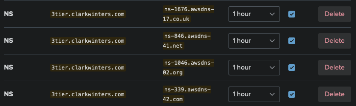

# 3 tier app infrastructure

This is sample AWS infrastructure configuration for an application with 3 tiers of services - web, API, and database. The web and API services, along with their deployment configuration, can be found in the [sample 3 tier services repo](https://github.com/cwinters8/sample-3tier-services).

The configuration creates:

- VPC
- Subnets
- Security groups
- IAM policies and roles
- ECS cluster, using Fargate for the compute provider
- ECR repositories for image storage
- Serverless Aurora PostgreSQL
- Secrets Manager secret to securely store the generated database user password
- Lambda function for instantiating the database user to be used by the API service
- Service endpoints to reach AWS services without reaching outside the VPC
- ACM Certificate for the domain
- KMS key for encryption

Services are deployed from a separate services repo to enable CI/CD pipelines to make service updates.

## Execution

### Local Prerequisites

- [awscli](https://docs.aws.amazon.com/cli/latest/userguide/cli-chap-getting-started.html) installed and configured with access keys for a user with sufficient permissions
- [terraform](https://developer.hashicorp.com/terraform/install) installed

### Terraform

#### AWS Prerequisites

##### Credentials

If you don't have keys configured in `~/.aws/credentials`, you will need to set the environment variables `AWS_ACCESS_KEY_ID` and `AWS_SECRET_ACCESS_KEY`. These are used for authenticating both the prerequisite awscli commands and terraform itself.

```sh
export AWS_ACCESS_KEY_ID="your_access_key_id"
export AWS_SECRET_ACCESS_KEY="your_secret_access_key"
```

##### S3 Bucket

Create an S3 bucket if you don't already have one to use for this purpose. Ideally the bucket should have versioning enabled.

You must also update the `terraform.backend.s3.bucket` value in [terraform/providers.tf](./terraform/providers.tf) with your chosen bucket name.

```sh
BUCKET_NAME="3tier-infra"
aws s3 mb s3://$BUCKET_NAME
# enables versioning
aws s3api put-bucket-versioning --bucket $BUCKET_NAME --versioning-configuration Status=Enabled
```

To validate

```sh
aws s3api get-bucket-versioning --bucket $BUCKET_NAME
```

Expected output

```json
{
  "Status": "Enabled"
}
```

##### DynamoDB Table

The table must have a partition key named `LockID` with type of `String`.

The table name must be unique within the AWS account's region. The `terraform.backend.s3.dynamodb_table` value in [terraform/providers.tf](./terraform/providers.tf) must also be updated with your chosen table name.

```sh
TABLE_NAME="3tier-infra"
aws dynamodb create-table --table-name $TABLE_NAME \
--attribute-definitions AttributeName=LockID,AttributeType=S \
--key-schema AttributeName=LockID,KeyType=HASH \
--billing-mode PAY_PER_REQUEST
```

Expected output

```json
{
  "TableDescription": {
    "AttributeDefinitions": [
      {
        "AttributeName": "LockID",
        "AttributeType": "S"
      }
    ],
    "TableName": "3tier-infra",
    "KeySchema": [
      {
        "AttributeName": "LockID",
        "KeyType": "HASH"
      }
    ],
    "TableStatus": "CREATING",
    "CreationDateTime": "2023-12-02T19:41:49.492000-06:00",
    "ProvisionedThroughput": {
      "NumberOfDecreasesToday": 0,
      "ReadCapacityUnits": 0,
      "WriteCapacityUnits": 0
    },
    "TableSizeBytes": 0,
    "ItemCount": 0,
    "TableArn": "arn:aws:dynamodb:us-east-2:773669924601:table/3tier-infra",
    "TableId": "93e1e87e-8470-481b-9b98-670081435820",
    "BillingModeSummary": {
      "BillingMode": "PAY_PER_REQUEST"
    },
    "DeletionProtectionEnabled": false
  }
}
```

Validate the table creates successfully

```sh
aws dynamodb describe-table --table-name $TABLE_NAME
```

Expected output, showing table status `ACTIVE`

```json
{
  "Table": {
    "AttributeDefinitions": [
      {
        "AttributeName": "LockID",
        "AttributeType": "S"
      }
    ],
    "TableName": "3tier-infra",
    "KeySchema": [
      {
        "AttributeName": "LockID",
        "KeyType": "HASH"
      }
    ],
    "TableStatus": "ACTIVE",
    "CreationDateTime": "2023-12-02T19:41:49.492000-06:00",
    "ProvisionedThroughput": {
      "NumberOfDecreasesToday": 0,
      "ReadCapacityUnits": 0,
      "WriteCapacityUnits": 0
    },
    "TableSizeBytes": 0,
    "ItemCount": 0,
    "TableArn": "arn:aws:dynamodb:us-east-2:773669924601:table/3tier-infra",
    "TableId": "93e1e87e-8470-481b-9b98-670081435820",
    "BillingModeSummary": {
      "BillingMode": "PAY_PER_REQUEST",
      "LastUpdateToPayPerRequestDateTime": "2023-12-02T19:41:49.492000-06:00"
    },
    "DeletionProtectionEnabled": false
  }
}
```

To get just the status value using `jq`

```sh
aws dynamodb describe-table --table-name $TABLE_NAME | jq '.Table.TableStatus'
```

Expected output

```json
"ACTIVE"
```

##### Route 53 Hosted Zone

The hosted zone for your domain or subdomain must exist prior to applying the terraform configuration so the ACM certificate can be validated successfully.

If you don't already have the zone in your account, create it

```sh
DOMAIN="3tier.clarkwinters.com"
REF=$(date +%Y%m%dT%H%M%S%z) # identifies the request in case it needs to be retried
aws route53 create-hosted-zone --name $DOMAIN --caller-reference $REF
```

Expected output

```json
{
  "Location": "https://route53.amazonaws.com/2013-04-01/hostedzone/Z05483161KTQBL5F1Q27U",
  "HostedZone": {
    "Id": "/hostedzone/Z05483161KTQBL5F1Q27U",
    "Name": "3tier.clarkwinters.com.",
    "CallerReference": "20231206T055624-0600",
    "Config": {
      "PrivateZone": false
    },
    "ResourceRecordSetCount": 2
  },
  "ChangeInfo": {
    "Id": "/change/C04379662D1CYD09ZHA6Q",
    "Status": "PENDING",
    "SubmittedAt": "2023-12-06T11:56:26.535000+00:00"
  },
  "DelegationSet": {
    "NameServers": [
      "ns-1676.awsdns-17.co.uk",
      "ns-846.awsdns-41.net",
      "ns-1046.awsdns-02.org",
      "ns-339.awsdns-42.com"
    ]
  }
}
```

The status will initially be `PENDING`. While the zone is creating, grab the nameservers from the output and add or update nameserver records with your DNS service provider for the domain or subdomain.

For example:



Check the status of the new hosted zone

```sh
ZONE_ID=$(aws route53 list-hosted-zones-by-name --dns-name $DOMAIN | jq '.HostedZones[0].Id' | tr -d '"')
aws route53 get-hosted-zone --id $ZONE_ID
```

Expected output

```json
{
  "HostedZones": [
    {
      "Id": "/hostedzone/Z05483161KTQBL5F1Q27U",
      "Name": "3tier.clarkwinters.com.",
      "CallerReference": "20231206T055624-0600",
      "Config": {
        "PrivateZone": false
      },
      "ResourceRecordSetCount": 2
    }
  ]
}
```

Listing the initial records sets

```sh
aws route53 list-resource-record-sets --hosted-zone-id $ZONE_ID
```

Expected output

```json
{
  "ResourceRecordSets": [
    {
      "Name": "3tier.clarkwinters.com.",
      "Type": "NS",
      "TTL": 172800,
      "ResourceRecords": [
        {
          "Value": "ns-1676.awsdns-17.co.uk."
        },
        {
          "Value": "ns-846.awsdns-41.net."
        },
        {
          "Value": "ns-1046.awsdns-02.org."
        },
        {
          "Value": "ns-339.awsdns-42.com."
        }
      ]
    },
    {
      "Name": "3tier.clarkwinters.com.",
      "Type": "SOA",
      "TTL": 900,
      "ResourceRecords": [
        {
          "Value": "ns-1676.awsdns-17.co.uk. awsdns-hostmaster.amazon.com. 1 7200 900 1209600 86400"
        }
      ]
    }
  ]
}
```

Validate the nameservers configuration for the domain

```sh
nslookup -type=ns $DOMAIN
```

Expected output

```log
Server:    192.168.1.1
Address:   192.168.1.1#53

Non-authoritative answer:
3tier.clarkwinters.com  nameserver = ns-1046.awsdns-02.org.
3tier.clarkwinters.com  nameserver = ns-1676.awsdns-17.co.uk.
3tier.clarkwinters.com  nameserver = ns-339.awsdns-42.com.
3tier.clarkwinters.com  nameserver = ns-846.awsdns-41.net.

Authoritative answers can be found from:

```

#### Initialize

Must be executed before the first plan or apply attempt, and again any time the [provider configuration](./terraform/providers.tf) changes.

```sh
terraform init
```

#### Plan (optional)

Useful for validating changes without executing.

```sh
terraform plan
```

The plan output is quite long and will probably overrun your terminal's scrollable area. If you want to view the entirety of the plan, pipe the output to `less`.

```sh
terraform plan | less -R
```

#### Apply

For executing the configuration. Will execute a plan and prompt for confirmation before applying unless the `-auto-approve` flag is supplied.

```sh
terraform apply
```

#### Tearing down

Before tearing down, you must change `force_delete` to `true` on the `aws_ecr_repository` resources in [api.tf](./terraform/api.tf) and [web.tf](./terraform/web.tf), then apply the change

```sh
terraform apply
```

Then you should be able to tear it down

```sh
terraform destroy
```
